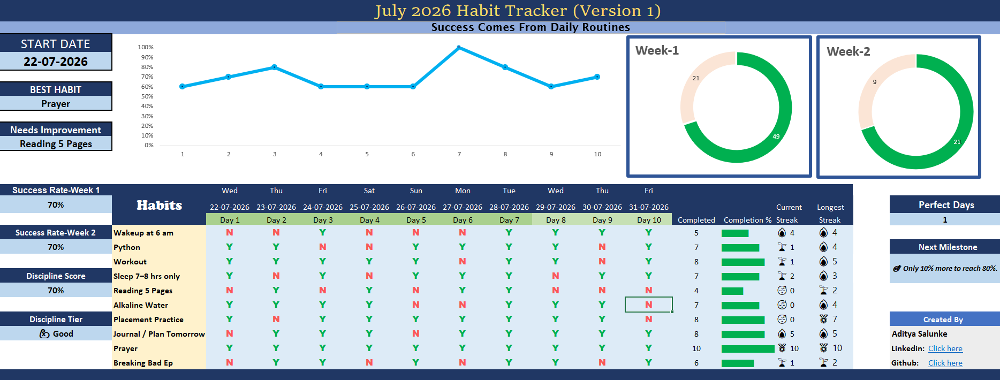
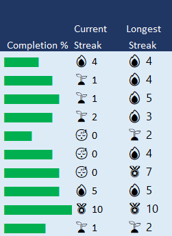
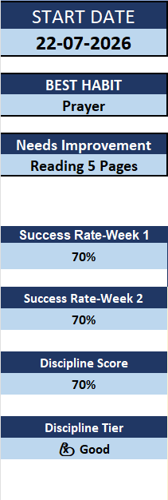

# Excel Habit Tracker Dashboard

A habit tracker dashboard built in Microsoft Excel to help track daily habits and visualise progress over time. The goal of this project was not just to create a habit tracker, but to challenge myself to build a clean, interactive dashboard using Excel.

## Features

- Daily habit tracking
- Interactive dashboard
- KPI cards
- Current & Longest Streak tracking (Custom VBA)
- Best Habit & Needs Improvement
- Success Rate & Discipline Score
- Progress bars
- Doughnut and Line Charts
- Dynamic dashboard updates using Excel formulas

## Tools & Concepts Used

**Excel Functions**
- COUNTIF()
- COUNT()
- MAX()
- MIN()
- XLOOKUP()
- IFS()
- Nested IF()
- SEQUENCE()
- REPT()

**Other**
- VBA User Defined Functions (UDF)
- Conditional Formatting
- Data Visualisation
- Dashboard Design

## Why I Built This

I wanted to build something beyond basic Excel practice. Instead of following a tutorial, I started with an idea and kept improving it feature by feature.

Every new section of the dashboard made me learn something different—whether it was writing complex formulas, creating custom VBA functions, or designing charts that actually looked good.

## What I Learned

- Building dashboards from scratch
- Writing and combining advanced Excel formulas
- Creating custom VBA functions
- Designing dashboards that are easy to read
- Debugging formulas and improving logic

## Development Process

Most of this project was built by experimenting, testing different ideas, and solving problems one by one. Whenever I got stuck or wanted to explore a different approach, I used AI as a learning companion to understand concepts, compare solutions, and improve the final result.

## Future Improvements

- Monthly & Yearly Dashboard
- Automatic month generation
- Better analytics
- Export reports
- More customization options

## Preview

